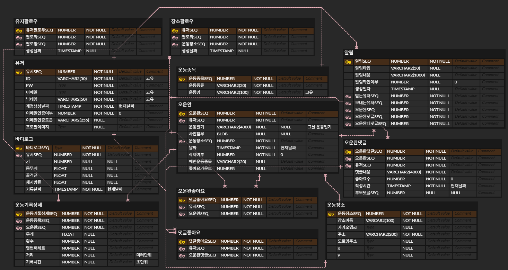
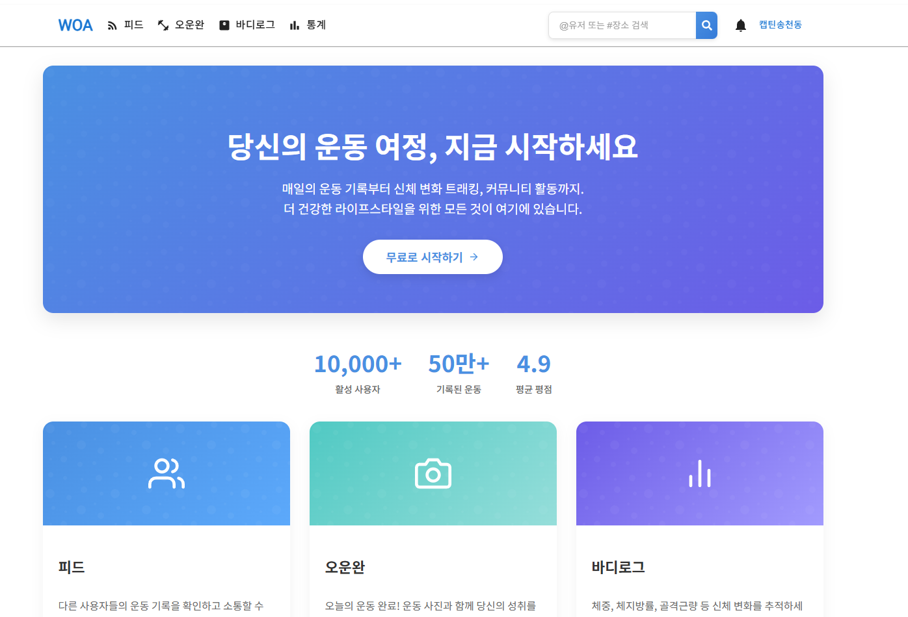
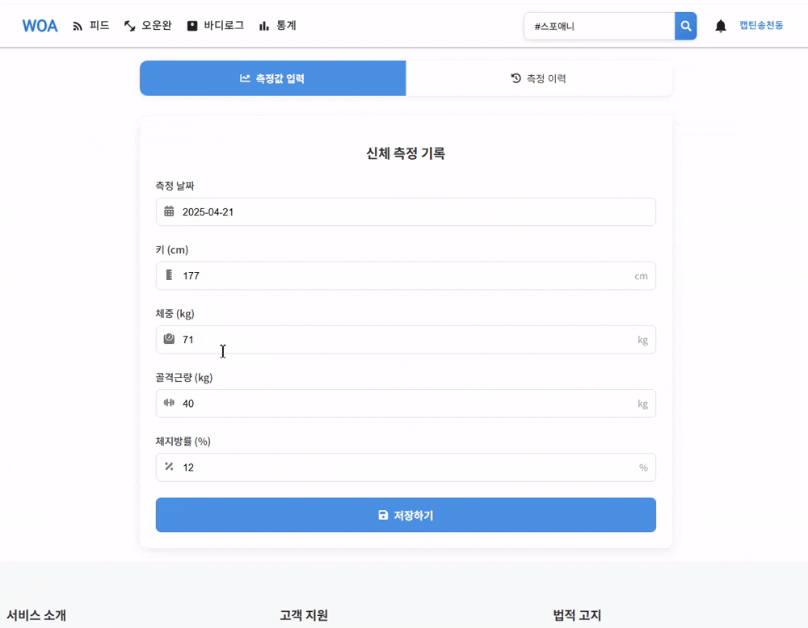
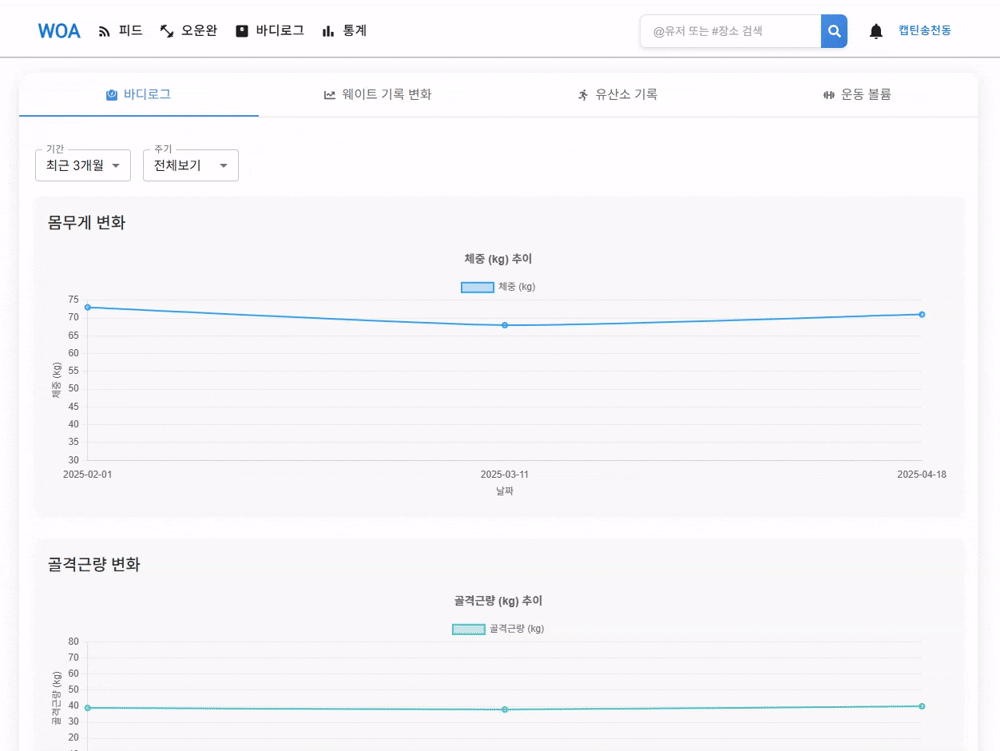
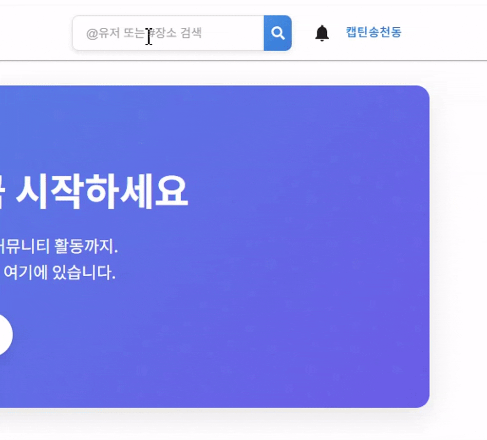

# Workout Archive


## 📝 프로젝트 개요

**Workout Archive**는 사용자가 운동 기록을 상세하게 저장하고, 다른 사용자와 공유하며 소통할 수 있는 풀스택 웹 애플리케이션입니다. 사용자 친화적인 UI/UX와 **운동 장소 기반의 소셜 네트워킹 기능**을 결합하여 운동 경험을 향상시키고, 이를 통해 **지역 커뮤니티 활성화 또한 기대**합니다.

## ✨ 주요 기능

- **사용자 관리:**
  - JWT 기반 이메일 인증 회원가입 및 로그인 (HttpOnly 쿠키 사용)
  - bcrypt를 사용한 안전한 비밀번호 관리
  - 프로필 정보 및 이미지 관리 (본인 확인 로직 포함)
  - 사용자 팔로우/언팔로우 기능 및 목록 조회
- **운동 기록 관리:**
  - 운동 종류, 세트, 무게, 횟수, 시간, 거리 등 상세 정보 기록 (드래그 앤 드롭 순서 조정)
  - 운동 수행 장소(헬스장 등) 선택 및 기록 저장
  - 텍스트 기반 운동 일지 작성 및 사진 첨부
  - 이전 운동기록 불러오기 기능을 통해 같은 루틴의 경우 간편하게 기록
  - 소프트 삭제를 통한 데이터 복구 가능성
- **소셜 및 커뮤니티:**
  - 팔로우 기반 피드 (사용자 및 **장소** 팔로우 가능, 무한 스크롤 적용)
  - 운동 기록에 대한 댓글 및 대댓글 기능 (좋아요 포함)
  - 운동 기록 및 댓글 좋아요 기능
  - 실시간 알림 (Socket.IO 기반: 좋아요, 댓글, 팔로우 등) 및 알림 관리
  - **장소 팔로우 및 장소별 기록 모아보기를 통한 로컬 커뮤니티 기능**
- **운동 장소:**
  - 카카오맵 API 연동 장소 검색, 선택 및 기록과 함께 저장
  - 특정 장소 팔로우 기능: 관심있는 헬스장 등의 소식을 피드에서 받아볼 수 있음.
  - 장소별 운동 기록 모아보기: 특정 장소 페이지에서 해당 장소에 남겨진 다른 사용자들의 '오운완' 기록들을 확인하고, 댓글 및 좋아요 등을 통해 직접 교류하며 로컬 커뮤니티를 형성 기대.
  - 장소 상세 페이지 (지도, 정보, 통계, 관련 기록 그리드 표시)
- **통계 및 시각화:**
  - 운동 및 바디로그 데이터 기반 통계 대시보드 제공
  - Chart.js 기반 시각화 (바디로그 변화, 운동별 중량/수행능력 변화, 운동 볼륨 분석)
  - 기간 필터링 및 인터랙티브 차트 (확대/축소)
- **검색:**
  - 접두사 기반 사용자(`@닉네임`) 및 장소(`#장소명`) 검색

## 🛠️ 기술 스택

| 구분           | 기술                                                                                                                                                                   |
| :------------- | :--------------------------------------------------------------------------------------------------------------------------------------------------------------------- |
| **공통**       | `TypeScript`                                                                                                                                                           |
| **백엔드**     | `Node.js`, `Express.js`, `TypeORM` (Oracle), `JWT`, `bcrypt`, `Socket.IO`, `Sharp` (이미지 처리), `Zod` (유효성 검증), `node-cron` (스케줄링), `Express Async Handler` |
| **프론트엔드** | `React`, `Redux`, `React Router`, `Emotion`, `Material-UI`, `Axios`, `React Calendar`, `Chart.js`, `React Chart.js`, `Kakao Maps API`, `Socket.IO Client`, `uuid`      |
| **개발 도구**  | `Git`, `GitHub`, `ESLint`, `Prettier`, `dotenv`                                                                                                                        |

## 📐 아키텍처 및 주요 구현 내용

### 백엔드

- **RESTful API 설계:** 자원 중심의 일관된 API 엔드포인트 설계
- **Controller-Service-Repository 패턴:** 역할 분리를 통한 코드의 모듈성 및 유지보수성 향상
  - **Controller:** HTTP 요청 처리, 데이터 유효성 검증 (Zod 활용), Service 호출, 조율
  - **Service:** 핵심 비즈니스 로직 구현 (단일 책임 원칙 준수), 트랜잭션 관리
  - **Repository:** TypeORM을 활용한 데이터베이스 접근 추상화
- **🔐 인증 및 보안**

  - JWT 기반 사용자 인증 시스템 구현
  - 로그인 시 JWT를 HttpOnly 쿠키에 저장하여 XSS 공격 방지
  - 쿠키 `sameSite`, `secure` 옵션 적용으로 CSRF 공격 위험 최소화
  - bcrypt 해싱을 통한 비밀번호 암호화
  - 미들웨어를 통한 API 접근 제어 (필수/선택적 인증) 및 리소스 소유권 검증

  ```ts
  // 쿠키에 JWT 저장 (UserController.ts)
  res.cookie("auth_token", token, {
    httpOnly: true,
    secure: process.env.NODE_ENV === "production",
    sameSite: "strict",
    maxAge: Number(process.env.MAX_COOKIE_AGE),
    path: "/",
  });
  ```

- **🖼️ 온디맨드 이미지 처리 및 캐싱:**

  - `Sharp` 라이브러리를 활용한 실시간 이미지 처리 (리사이징, 포맷 변환, 품질 조정) - URL 쿼리 파라미터(`w`, `h`, `q`, `f`) 기반
  - 변환된 이미지를 파일 시스템에 캐싱하여 반복 요청 처리 속도 향상 및 서버 부하 감소 (캐시 키: `경로-w값-h값-q값-f값`)
  - `setInterval`을 이용한 주기적인 캐시 파일 정리 (`CacheManager`, 예: 24시간)

  ```typescript
  // 이미지 처리 미들웨어 (imageProcessor.ts - 일부)
  // ... 캐시 확인 로직 ...
  // 캐시된 이미지가 없으면 처리 진행
  let pipeline = sharp(imagePath);

  // 리사이징
  if (width > 0 || height > 0) {
    pipeline = pipeline.resize(width || null, height || null, {
      fit: "inside",
      withoutEnlargement: true,
    });
  }

  // 포맷 변환 및 품질 적용
  switch (format) {
    case "webp":
      pipeline = pipeline.webp({ quality });
      break;
    case "png":
      pipeline = pipeline.png({ quality: quality / 100 });
      break;
    default:
      pipeline = pipeline.jpeg({ quality });
  }

  // 처리된 이미지를 캐시 파일로 저장
  await pipeline.toFile(cachePath);

  // 응답
  res.sendFile(cachePath);

  // 캐시 정리 로직 (index.ts)
  setInterval(() => {
    CacheManager.cleanOldCache();
  }, 24 * 60 * 60 * 1000); // 24시간마다 실행
  ```

- **🔔 실시간 알림 시스템 (Socket.IO):**

  - `Socket.IO`를 사용한 실시간 알림 전송 (좋아요, 댓글, 팔로우 등)
  - `SocketServerManager` (싱글톤)를 통한 웹소켓 서버 초기화 및 관리
  - 클라이언트 연결 시 JWT 기반 사용자 인증 (`authenticate` 이벤트, HttpOnly 쿠키 검증)
  - 사용자별 소켓 연결 관리 (`Map<userSeq, socket.id>`) 및 타겟 알림 전송
  - `NotificationService`와 `SocketUtil` 연동: 알림 생성/변경 시 관련 사용자에게 웹소켓 이벤트 전송 (`new_notification`, `UPDATE`, `DELETE` 등)

  ```typescript
  // 소켓 서버 설정 및 인증 (SocketServerManager.ts - 일부)
  this.io.on(SocketEvent.CONNECT, (socket: ClientSocket) => {
    socket.on(SocketEvent.AUTHENTICATE, async (data: AuthPayload) => {
      // ... 쿠키에서 JWT 토큰 추출 및 검증 ...
      const decodedToken = verifyToken(token) as JwtPayload;
      const userSeq = decodedToken.userSeq as number;
      socket.userSeq = userSeq;
      // ... userSockets 맵에 사용자 정보 저장 ...
    });
    socket.on(SocketEvent.DISCONNECT, () => {
      // ... userSockets 맵에서 사용자 정보 제거 ...
    });
  });

  // 특정 사용자에게 알림 전송 (SocketServerManager.ts)
  public sendNotification(userSeq: number, notification: NotificationDTO): void {
    const socketIds = this.userSockets.get(userSeq);
    if (socketIds && socketIds.size > 0) {
      socketIds.forEach((socketId) => {
        this.io.to(socketId).emit(SocketEvent.NEW_NOTIFICATION, { notification });
      });
    }
  }

  // 알림 서비스에서 실시간 알림 호출 (NotificationService.ts)
  private sendRealTimeNotification(notification: Notification, receiverSeq: number): void {
    const notificationDto = NotificationMapper.toDTO(notification);
    SocketUtil.sendNotification(receiverSeq, notificationDto);
  }
  ```

- **🔒 데이터 유효성 검증 (Zod):**

  - `Zod` 라이브러리를 사용한 요청 데이터(body, query, params) 타입 및 형식 검증
  - 스키마 정의(`schema/`) 및 `ValidationUtil`을 통한 검증 로직 추상화 및 컨트롤러 적용 간소화
  - 검증 실패 시 `ValidationUtil`에서 `CustomError` 발생 -> `globalErrorHandler`에서 일관된 에러 응답 처리 연계

  ```typescript
  // Zod 스키마 정의 예시 (RegisterSchema.ts)
  export const RegisterSchema = z.object({
    userEmail: z.string().email("유효한 이메일 형식이 아닙니다."),
    userPassword: z.string().min(6, "비밀번호는 6자 이상이어야 합니다."),
    userNickname: z.string().min(2, "닉네임은 2자 이상이어야 합니다."),
  });

  // 컨트롤러에서 ValidationUtil 사용 예시 (RegisterController.ts)
  public registerUser = asyncHandler(
    async (req: Request, res: Response): Promise<void> => {
      const registerData: RegisterDTO = ValidationUtil.validateBody(
        req,
        RegisterSchema,
        "회원가입 정보가 유효하지 않습니다.",
        "RegisterController.registerUser"
      );
      // ... 서비스 호출 ...
    }
  );
  ```

- **🚦 배치 처리 (Scheduled Jobs):**
  - `node-cron`을 활용하여 주기적인 백그라운드 작업 수행
  - 미인증 사용자 자동 정리 (`UserCleanupScheduler`)
  - 소프트 삭제된 운동 기록 영구 삭제 (`WorkoutCleanupScheduler`)
  - 이미지 캐시 정리 (위 이미지 처리 섹션 참고)
- **🚨 중앙 집중식 에러 핸들링:**

  - `CustomError` 클래스와 `globalErrorHandler` 미들웨어를 사용한 애플리케이션 전역 에러 처리
  - 예측 가능한 오류 발생 시 `CustomError` 생성 (상태 코드, 발생 위치 정보 포함)
  - `globalErrorHandler`에서 `CustomError` 인스턴스 확인 후 상태 코드/메시지 기반 응답 전송 (이외 500 오류 처리)
  - 개발 환경에서 에러 발생 위치 및 상세 정보(`details`) 응답 추가로 디버깅 편의성 증대

  ```typescript
  // CustomError 클래스 (utils/customError.ts)
  export class CustomError extends Error {
    public status: number;
    public location: string;
    public details?: any[]; // Zod 에러 등 상세 정보

    constructor(
      message: string,
      status: number,
      location: string = "unknown",
      details?: any[]
    ) {
      super(message);
      this.status = status;
      this.location = location;
      this.details = details;
      Object.setPrototypeOf(this, CustomError.prototype);
    }
  }

  // GlobalErrorHandler 미들웨어 (middlewares/globalErrorHandler.ts)
  export const GlobalErrorHandler = (
    err: Error,
    req: Request,
    res: Response,
    next: NextFunction
  ) => {
    console.error(
      `[ERROR] Location: ${
        err instanceof CustomError ? err.location : "unknown"
      }`,
      err
    );

    if (err instanceof CustomError) {
      res.status(err.status).json({
        error: {
          message: err.message,
          ...(process.env.NODE_ENV === "development" && {
            location: err.location,
            details: err.details,
          }),
        },
      });
    } else {
      res.status(500).json({ error: { message: "서버 내부 오류" } });
    }
  };
  ```

### 데이터베이스 설계 (ERD)



### 프론트엔드

- **컴포넌트 기반 아키텍처:** 재사용 가능한 UI 컴포넌트(카드, 모달, 폼, 차트 등) 설계 및 관심사 분리
- **상태 관리:** `Redux` (전역 상태: 사용자 인증, 테마 등) 및 `React Context API` (지역적 상태) 활용
- **라우팅 및 접근 제어:** `React Router` 기반 라우팅 및 `ProtectedRoute`, `GuestGuard`를 통한 페이지 접근 권한 관리
- **스타일링:** `Material-UI`와 `Emotion`을 활용한 디자인 시스템 구축 및 커스텀 테마 적용
- **커스텀 훅:** 반복되는 로직(폼 관리, 인증, 페이지네이션, 데이터 fetching 등)을 분리하여 재사용성 증대
- **데이터 시각화:** `Chart.js`와 `React Chart.js`를 활용하여 통계 데이터를 인터랙티브 그래프로 표현
- **지도 연동:** `Kakao Maps API`를 활용하여 운동 장소 검색 및 지도 표시
- **📌 알림 상호작용:**

  - 알림 클릭 시(`NotificationItem`) 타입(`notificationType`)에 따른 분기 처리:
    - 댓글/대댓글/좋아요: 오운완 모달(`WorkoutDetailModal`) 열기 및 관련 ID 전달
    - 팔로우: 사용자 프로필 페이지로 이동 (`navigate`)
  - 오운완 모달(`CommentSection`)에서 전달받은 ID 기반으로 해당 댓글/대댓글 위치로 스크롤 이동 (`useEffect`, `useRef`, `scrollIntoView`) 및 대댓글 자동 펼침 처리

  ```tsx
  // 알림 클릭 시 모달 열기 또는 페이지 이동 (NotificationItem.tsx - handleItemClick 일부)
  const handleItemClick = async () => {
    // ... 읽음 처리 ...
    const {
      notificationType,
      workoutOfTheDaySeq,
      workoutCommentSeq,
      replyCommentSeq,
      senderNickname,
    } = notification;

    if (
      notificationType === NotificationType.REPLY ||
      notificationType === NotificationType.REPLY_LIKE
    ) {
      if (openWorkoutModal) {
        openWorkoutModal({
          // 오운완 모달 열기 함수 호출
          workoutId: workoutOfTheDaySeq!,
          isReplyNotification: true,
          parentCommentId: workoutCommentSeq!,
          replyCommentId: replyCommentSeq!,
        });
      }
    } else if (
      notificationType === NotificationType.COMMENT ||
      notificationType === NotificationType.COMMENT_LIKE
    ) {
      if (openWorkoutModal) {
        openWorkoutModal({
          workoutId: workoutOfTheDaySeq!,
          commentId: workoutCommentSeq!,
        });
      }
    } else if (notificationType === NotificationType.FOLLOW) {
      navigate(`/profile/${senderNickname}`); // 팔로우 알림은 프로필로 이동
    } else {
      // 기타 오운완 관련 알림 (좋아요 등)
      if (openWorkoutModal) {
        openWorkoutModal({ workoutId: workoutOfTheDaySeq! });
      }
    }
  };

  // 댓글 섹션에서 특정 댓글/대댓글로 스크롤 (CommentSection.tsx - useEffect 일부)
  useEffect(() => {
    if (initialLoadComplete) {
      let targetElementRef: React.RefObject<HTMLDivElement> | null = null;
      // ... 알림 타입과 ID에 따라 targetCommentRef 또는 targetReplyRef 설정 ...
      if (isReplyNotification && replyCommentId && targetReplyRef.current) {
        targetElementRef = targetReplyRef;
      } else if (targetCommentId && targetCommentRef.current) {
        targetElementRef = targetCommentRef;
      }

      if (targetElementRef?.current) {
        const timer = setTimeout(() => {
          targetElementRef!.current?.scrollIntoView({
            behavior: "smooth",
            block: "center",
          });
        }, 500); // 데이터 로드 후 약간의 지연
        return () => clearTimeout(timer);
      }
    }
  }, [
    initialLoadComplete,
    targetCommentId,
    replyCommentId,
    isReplyNotification,
  ]);
  ```

- **성능 최적화:**
  - `React.memo` 활용 및 불필요한 리렌더링 방지
  - 서버 측 이미지 처리 및 캐싱 (Sharp 라이브러리 활용 및 최적화된 이미지 요청)
  - 운동 목록 등 정적 데이터 HTTP 캐싱 (`Cache-Control` 헤더 설정)
  - 코드 스플리팅 (라우트/컴포넌트 단위로 코드를 분할하여 초기 로딩 시간 단축)

### 성능 및 보안

- **성능:** 이미지 처리/캐싱, 무한 스크롤(커서 기반 페이지네이션), TypeORM 쿼리 최적화(인덱싱, 조인 최적화), 프론트엔드 메모이제이션 및 리소스 관리 등을 통해 성능 개선
- **보안:** JWT/HttpOnly 쿠키 인증, bcrypt 해싱, Zod 기반 입력값 검증, 리소스 접근 권한 제어 적용

## 📈 개발 과정 및 배운 점

### 개발 과정

- 사용자 요구사항 예상 및 분석, 기능 명세, DB 스키마(ERD), API 설계 등 체계적인 기획 단계를 거쳤습니다.
- 기능 단위 개발, 테스트, 코드 리뷰를 통해 점진적으로 프로젝트를 완성했습니다.
- 지속적인 리팩토링으로 코드 품질을 관리하고 개선했습니다.

### 주요 학습 내용

- **TypeScript**의 정적 타이핑을 활용하여 코드 안정성 및 생산성을 향상시킨 경험
- **TypeORM**을 이용한 객체 지향적 DB 관리, 복잡한 쿼리 작성 및 최적화 경험
- **React/Redux** 기반의 상태 관리 아키텍처 설계 및 단방향 데이터 흐름 이해
- **Controller-Service-Repository** 패턴 적용을 통한 백엔드 아키텍처 설계 역량
- **단일 책임 원칙(SRP)** 서비스 계층을 설계하고 모듈 간 결합도를 낮춘 경험
- **Zod 스키마** 데이터 유효성 검증 로직을 체계화하고 안정성을 높인 경험
- **JWT, Cookie, bcrypt**를 활용한 안전하고 효율적인 인증 시스템 구현 능력
- **On-demand 이미지 처리 및 캐싱** 시스템 설계 및 구현 경험 (Sharp, File System Cache)
- **Socket.IO**를 활용한 실시간 웹 기능 구현 및 웹소켓 관리 경험
- **Chart.js**를 이용한 데이터 시각화 및 사용자 인터랙션 구현 능력
- 성능 최적화 (DB 쿼리, 서버 캐싱, 프론트엔드 렌더링) 및 보안 고려사항 적용 경험

### 도전 과제 및 해결

- **복잡한 데이터 모델링:** TypeORM의 관계 매핑과 커스텀 Repository를 활용하여 해결
- **실시간 상호작용 구현:** Socket.IO와 Redux를 연동하여 효율적인 상태 동기화 구현
- **대규모 데이터 처리:** 통계 쿼리 최적화 및 페이지네이션 적용으로 성능 확보
- **이미지 최적화:** 요청 기반 이미지 처리 및 캐싱 시스템 구축으로 사용자 경험 개선

## 🔍 프로젝트 시연

### 메인 페이지



### 피드


### 오운완 (게시글) 작성


### 프로필, 장소 페이지, 오운완(게시글) 모달, 댓글 등


### 실시간 알림


### 바디로그



### 통계



### 검색



## 🔮 추가 개선 아이디어

- 테스트 코드 강화 (단위, 통합, E2E)
- CI/CD 파이프라인 구축
- 고급 통계 기능 및 AI 기반 운동 추천/분석 기능 도입
- 소셜 로그인, 회원가입 (Google, Kakao 등) 지원
- 클라우드 인프라(AWS S3, CDN 등) 활용
- 모바일 앱 버전 개발
- GPS 이용 기능 도입
- 차단기능 도입

## 💡 설치 및 실행 방법

### 요구사항

- Node.js v14 이상
- Oracle Database
- npm 또는 yarn

### 백엔드 설정

```bash
# 저장소 클론 및 이동
git clone https://github.com/HHOWI/workout-archive-be.git # 백엔드 레포 주소 확인 필요
cd workout-archive-be

# 의존성 설치
npm install

# .env 파일 생성 및 설정 (아래 내용 참고)
# 예시:
# DB_USERNAME=your_username
# DB_PASSWORD=your_password
# DB_HOST=localhost
# DB_PORT=1521
# DB_SID=xe
# JWT_SECRET=your_jwt_secret
# PORT=3001
# COOKIE_SECRET=your_cookie_secret
# UPLOAD_DIR=./uploads
# CACHE_DIR=./cache
# MAX_CACHE_AGE=604800000 # 7 days in ms
# PROFILE_UPLOAD_PATH=uploads/profiles
# POST_UPLOAD_PATH=uploads/posts
# FRONTEND_URL=http://localhost:3000 # 프론트엔드 주소
# BCRYPT_SALT_ROUNDS=10

# 데이터베이스 시딩 (필요시)
# npm run seed

# 개발 서버 실행
npm run dev
```

### 프론트엔드 설정

```bash
# 저장소 클론 및 이동
git clone https://github.com/HHOWI/workout-archive-fe.git # 프론트엔드 레포 주소 확인 필요
cd ../workout-archive-fe # workout-archive-be와 같은 경로에 있다고 가정

# 의존성 설치
npm install

# .env 파일 생성 및 설정 (아래 내용 참고)
# 예시:
# REACT_APP_API_URL=http://localhost:3001 # 백엔드 API 주소
# REACT_APP_KAKAO_MAP_API_KEY=your_kakao_api_key
# REACT_APP_SOCKET_URL=http://localhost:3001 # 백엔드 소켓 주소

# 개발 서버 실행
npm run dev
```

## 📫 연락처

- **GitHub**: [https://github.com/HHOWI](https://github.com/HHOWI)
- **Backend Repository**: [https://github.com/HHOWI/workout-archive-be](https://github.com/HHOWI/workout-archive-be)
- **Frontend Repository**: [https://github.com/HHOWI/workout-archive-fe](https://github.com/HHOWI/workout-archive-fe)

## 🙏 감사의 말

감사합니다.

---
